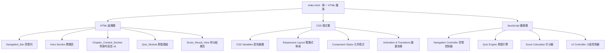

# 設計文件

## 概述

本設計文件描述《Vibe Coding》第七章「需要學習的技能」互動式網站的技術架構與實作方案。網站以單一 HTML 檔案實作，內嵌 CSS 與 JavaScript，無需後端伺服器或建置工具。網站包含章節內容展示、導覽功能、5 題選擇題測驗（滿分 100 分），以及響應式設計，支援桌面與行動裝置。

### 設計決策

1. **單檔架構**：所有 HTML、CSS、JavaScript 內嵌於一個檔案中，簡化部署與維護。
2. **純前端實作**：不依賴任何外部框架或函式庫，使用原生 HTML5、CSS3、ES6+ JavaScript。
3. **CSS 變數配色**：使用 CSS custom properties 統一管理配色方案，確保視覺一致性。
4. **Scroll-based 導覽**：使用 Intersection Observer API 偵測目前可見的章節，自動更新導覽列的 active 狀態。
5. **狀態管理**：測驗模組使用 JavaScript 物件管理使用者的作答狀態與計分邏輯，不依賴外部狀態管理工具。

## 架構

### 整體架構圖



### 頁面結構流程


## 元件與介面

### 1. Navigation_Bar（導覽列）

- **位置**：頁面頂部，固定定位（`position: sticky`）
- **功能**：
  - 顯示 5 個小節的導覽連結
  - 點擊連結時使用 `scrollIntoView({ behavior: 'smooth' })` 平滑捲動
  - 使用 Intersection Observer 偵測目前可見章節，更新 active class
- **介面**：
  ```
  navigateTo(sectionId: string): void
  updateActiveSection(): void
  ```

### 2. Chapter_Content_Section（章節內容區）

- **結構**：每個小節為一個 `<section>` 元素，包含標題、摘要文字、關鍵概念卡片
- **7-1 回饋迴路**：Isabella vs Vincent 主廚對比卡片、CI/CD 回饋迴路概念、State of DevOps Reports 引用
- **7-2 模組化系統**：模組化廚房比喻、Dan Sturtevant 研究（9 倍離職率）、Alexander Embiricos / ChatGPT Codex 故事、agent 衝突偵測
- **7-3 擁抱學習**：學習如何學習、Gene & Steve FFmpeg 故事、Anders Ericsson 四大支柱（專家指導、快速回饋、刻意練習、任務挑戰）
- **7-4 精進技術**：Isabella 熱愛烹飪 vs Vincent 為生活而煮、熱情驅動技能發展
- **7-5 小結**：Erik Meijer 名言、Vibe Coding 五大價值觀、為第二部分做準備
- **視覺化**：Isabella vs Vincent 對比使用雙欄卡片佈局，行動裝置時堆疊為單欄

### 3. Quiz_Module（測驗模組）

- **功能**：
  - 渲染 5 道選擇題，每題 4 個選項
  - 記錄使用者選擇
  - 驗證是否所有題目都已作答
  - 提交後計算分數
- **介面**：
  ```
  selectAnswer(questionIndex: number, optionIndex: number): void
  validateAllAnswered(): boolean
  submitQuiz(): QuizResult
  ```

### 4. Score_Result_View（得分結果頁）

- **功能**：
  - 顯示總分（0-100）
  - 逐題顯示正確/錯誤狀態與正確答案
  - 根據分數範圍顯示回饋訊息
  - 提供重新測驗按鈕
- **回饋訊息邏輯**：
  - 100 分：「🎉 完美！你完全掌握了第七章的精髓！」
  - 80-99 分：「👏 很棒！你對這章的理解非常深入！」
  - 60-79 分：「👍 不錯！但還有一些概念可以再複習。」
  - 60 分以下：「💪 再加油！建議重新閱讀章節內容後再試一次。」
- **介面**：
  ```
  showResult(result: QuizResult): void
  resetQuiz(): void
  ```

### 5. UI Controller（介面控制器）

- **功能**：協調各元件之間的互動，處理事件綁定與 DOM 操作
- **介面**：
  ```
  init(): void
  bindEvents(): void
  showSection(sectionName: string): void
  ```

## 資料模型

### Question（題目）

```javascript
{
  id: number,           // 題目編號 (1-5)
  text: string,         // 題幹文字
  options: string[],    // 4 個選項文字陣列
  correctIndex: number  // 正確答案的索引 (0-3)
}
```

### UserAnswer（使用者作答）

```javascript
{
  questionId: number,     // 對應題目編號
  selectedIndex: number   // 使用者選擇的選項索引 (0-3)，未作答為 -1
}
```

### QuizResult（測驗結果）

```javascript
{
  totalScore: number,     // 總分 (0-100)
  answers: [{
    questionId: number,
    selectedIndex: number,
    correctIndex: number,
    isCorrect: boolean
  }],
  feedbackMessage: string // 回饋訊息
}
```

### QuizState（測驗狀態）

```javascript
{
  questions: Question[],       // 5 道題目
  userAnswers: UserAnswer[],   // 使用者作答記錄
  isSubmitted: boolean,        // 是否已提交
  result: QuizResult | null    // 測驗結果
}
```

### 題目內容（5 道題目）

| # | 涵蓋小節 | 題目主題 |
|---|---------|---------|
| 1 | 7-1 | Isabella 與 Vincent 主廚的差異 / 回饋迴路的重要性 |
| 2 | 7-2 | 模組化系統的好處 / Dan Sturtevant 研究發現 |
| 3 | 7-3 | Anders Ericsson 刻意練習四大支柱 |
| 4 | 7-4 | 熱情與技能發展的關係 |
| 5 | 7-5 | Vibe Coding 的核心價值觀 / Erik Meijer 名言 |


## 正確性屬性 (Correctness Properties)

*屬性（Property）是一種在系統所有有效執行中都應成立的特徵或行為——本質上是對系統應做什麼的形式化陳述。屬性是人類可讀規格與機器可驗證正確性保證之間的橋樑。*

### Property 1: 測驗結構不變量 (Quiz Structure Invariant)

*For any* quiz state, the questions array shall always contain exactly 5 questions, and each question shall have exactly 4 options and a correctIndex in the range [0, 3].

**Validates: Requirements 3.1**

### Property 2: 選擇答案更新狀態 (Answer Selection Updates State)

*For any* question index in [0, 4] and any option index in [0, 3], calling selectAnswer(questionIndex, optionIndex) shall update the corresponding userAnswer's selectedIndex to the given optionIndex.

**Validates: Requirements 3.3**

### Property 3: 未完成作答驗證 (Incomplete Submission Validation)

*For any* set of user answers where at least one question has selectedIndex equal to -1 (unanswered), validateAllAnswered() shall return false.

**Validates: Requirements 3.5**

### Property 4: 計分公式 (Score Calculation Formula)

*For any* set of 5 user answers, the total score shall equal the count of correct answers multiplied by 20, yielding a value in {0, 20, 40, 60, 80, 100}.

**Validates: Requirements 4.1**

### Property 5: 逐題正確性標示 (Per-Question Correctness Marking)

*For any* quiz result, each answer entry's isCorrect field shall be true if and only if the selectedIndex equals the correctIndex for that question.

**Validates: Requirements 4.3**

### Property 6: 回饋訊息對應分數範圍 (Feedback Message Matches Score Range)

*For any* score in {0, 20, 40, 60, 80, 100}, the feedback message shall correspond to the defined ranges: 100 → "完美", 80-99 → "很棒", 60-79 → "不錯", 0-59 → "再加油".

**Validates: Requirements 4.4**

### Property 7: 重新測驗重置狀態 (Quiz Reset Clears State)

*For any* quiz state (submitted or not), calling resetQuiz() shall set all userAnswers' selectedIndex to -1, set isSubmitted to false, and set result to null.

**Validates: Requirements 4.5**

### Property 8: 繁體中文介面文字 (Traditional Chinese Interface Text)

*For any* visible text node in the rendered page, the text content shall contain Traditional Chinese characters (Unicode range CJK Unified Ideographs) or standard punctuation/numbers, with no English-only UI labels.

**Validates: Requirements 1.5**

## 錯誤處理 (Error Handling)

### 測驗模組錯誤處理

| 錯誤情境 | 處理方式 |
|---------|---------|
| 使用者未完成所有題目就提交 | 顯示提示訊息「請回答所有題目後再提交」，不執行計分 |
| 使用者重複點擊提交按鈕 | 已提交狀態下忽略重複提交，防止重複計分 |
| 使用者在結果頁重新選擇答案 | 結果頁不允許修改答案，選項為唯讀狀態 |

### 導覽錯誤處理

| 錯誤情境 | 處理方式 |
|---------|---------|
| 導覽目標 section 不存在 | 使用 `document.getElementById` 檢查，不存在時不執行捲動 |
| Intersection Observer 不支援 | 降級為不顯示 active 狀態，導覽連結仍可點擊跳轉 |

### 一般錯誤處理

- JavaScript 錯誤不應導致頁面白屏，內容區域應始終可見
- 所有事件處理器使用 try-catch 包裹關鍵邏輯

## 測試策略 (Testing Strategy)

### 雙重測試方法

本專案採用單元測試與屬性測試並行的策略，確保全面覆蓋。

### 單元測試 (Unit Tests)

使用場景：驗證特定範例、邊界條件與錯誤情境。

- **測驗結構驗證**：確認 5 道題目存在，每題有 4 個選項（Requirements 3.1, 3.2）
- **導覽連結存在性**：確認 5 個導覽連結存在（Requirements 2.1）
- **章節標題驗證**：確認頁面包含「第七章：需要學習的技能」標題（Requirements 1.2）
- **Isabella vs Vincent 卡片存在性**：確認對比卡片 DOM 元素存在（Requirements 1.4）
- **提交按鈕存在性**：確認「提交答案」按鈕存在（Requirements 3.4）
- **結果頁顯示**：提交後確認結果頁可見且顯示分數（Requirements 4.2）
- **邊界條件**：全對（100 分）、全錯（0 分）、部分正確的計分驗證

### 屬性測試 (Property-Based Tests)

使用 **fast-check** 作為屬性測試函式庫（JavaScript 生態系中成熟的 PBT 工具）。

每個屬性測試至少執行 100 次迭代，使用隨機生成的輸入驗證屬性是否成立。

每個測試須以註解標記對應的設計屬性：

```javascript
// Feature: vibe-coding-chapter7-interactive, Property 1: Quiz Structure Invariant
// Feature: vibe-coding-chapter7-interactive, Property 2: Answer Selection Updates State
// Feature: vibe-coding-chapter7-interactive, Property 3: Incomplete Submission Validation
// Feature: vibe-coding-chapter7-interactive, Property 4: Score Calculation Formula
// Feature: vibe-coding-chapter7-interactive, Property 5: Per-Question Correctness Marking
// Feature: vibe-coding-chapter7-interactive, Property 6: Feedback Message Matches Score Range
// Feature: vibe-coding-chapter7-interactive, Property 7: Quiz Reset Clears State
```

### 屬性測試對應表

| 屬性 | 測試描述 | 生成器策略 |
|-----|---------|-----------|
| Property 1 | 驗證測驗結構不變量 | 生成隨機 questions 陣列，驗證長度與選項數 |
| Property 2 | 驗證選擇答案更新狀態 | 生成隨機 questionIndex (0-4) 與 optionIndex (0-3)，驗證狀態更新 |
| Property 3 | 驗證未完成作答驗證 | 生成隨機 userAnswers 陣列（至少一個為 -1），驗證 validateAllAnswered 回傳 false |
| Property 4 | 驗證計分公式 | 生成隨機 5 個 boolean（正確/錯誤），驗證分數 = 正確數 × 20 |
| Property 5 | 驗證逐題正確性標示 | 生成隨機 selectedIndex 與 correctIndex 配對，驗證 isCorrect 欄位 |
| Property 6 | 驗證回饋訊息對應 | 生成隨機分數 {0,20,40,60,80,100}，驗證回饋訊息符合範圍 |
| Property 7 | 驗證重置狀態 | 生成隨機已作答狀態，呼叫 resetQuiz 後驗證所有欄位已清除 |

### 測試工具

- **測試框架**：Vitest（輕量、快速、與 ES modules 相容）
- **屬性測試**：fast-check（JavaScript PBT 函式庫）
- **測試執行**：`vitest --run`（單次執行，非 watch 模式）

### 注意事項

- Property 8（繁體中文介面文字）因需要完整 DOM 環境，建議以手動檢查或 E2E 測試驗證
- 單元測試聚焦於特定範例與邊界條件，避免過多重複
- 屬性測試負責覆蓋大量隨機輸入，確保通用正確性
